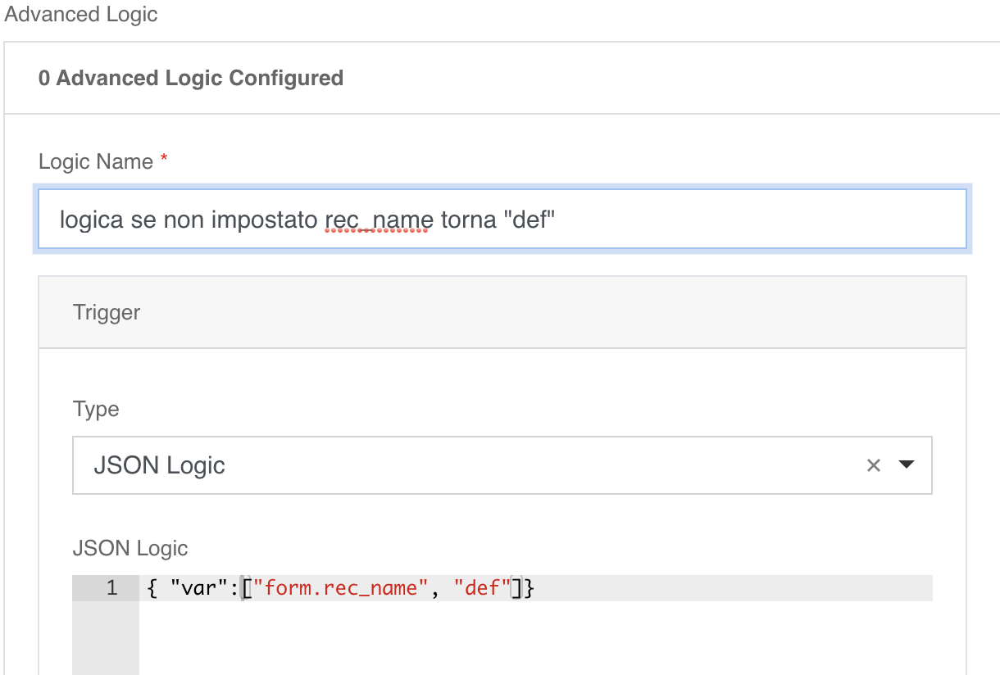

# Logic: Json-Logic
##### Guide →[Json-logic](https://jsonlogic.com/operations.html) 

**Sezione Conditional → Advanced Conditions → JSONLogic**  
The logics in this section are “negated” by default as they act directly
on the property ”__hidden__” of the field in which they are inserted.  
- The result of the inserted logic must be boolean
- Logical map:
    - {logic} ==> True → Result = False
    - {logic} ==> False → Result = True

**Logic section**  
Field logics are managed only with **json logic**; it is possible to insert multiple logics, for each logic it is possible to insert multiple actions.  
The logics are divided into two specific groups:**conditions, actions**  
The **conditions** are elements that the configurator identifies with **Logic**, the actions are elements that the configurator identifies with **Action**.  
In json-logic expressions you can use in **"var"** the following objects:  

**form.[Property Name ] →  form.rec_name**  
**form.data_value.[Property Name ]  → form.data_value.dataOra**  
**user.{[metadata](base.md#metadata)}**

As regards the actions, it is possible to manage only the following types of actions: **Property** or **Value**   
- **Property →** the selected property takes on the value entered in the appropriate field  

    

- **Value →**
 And It is possible to enhance any property of the field in the following ways:  
    - with the result of **condition** if you enter only the name of the property  
    - with an operation **json-logic** if it fits **field_name=’{“var”:[....]}’**
    
    

[Return home](index.md)
