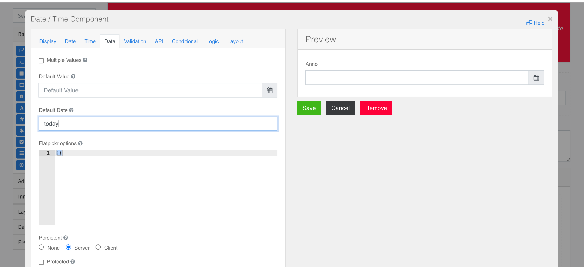

### Datetime
Implementa le [configurazioni standard](../../base.md#Neicomponentisonogestiteleseguentiproprietà)   
Con il campo datetime è possibile gestire i campi **data** o **data e ora**   
Nella versione attuale  il formato del campo **Format** nel configuratore non è gestito.

E’ possibile, agendo sul flag: **Enable Time Input** true/false, attivare o disattivare l’ora nel campo del form. E’ possibile attivare la data o data/ora odierna imposta **Default Date a Today**

<font color=" #e74c3c">**Non usare il campo per gestire un anno specifico. Nel caso usare una select risorsa**.</font>



### Datetime calendar range


Per gestire un calendario **data inizio ~ data fine** dinamico e’ necessario inserire i due campi data, impostati **date** o **datetime** es:  
  - **dateStart**
  - **dateEnd**

Quindi nel campo dateEnd aggiungere la seguente logica Json
​​
```
[  
 {   
      "name": "check start",
      "trigger": {
        "type": "json",
        "json": {
          "var": "form.dateStart"
        }
      },
      "actions": [
        {
          "name": "update min",
          "type": "value",
          "value": "min={\"var\":\"form.dateStart\"}"
        }
      ]
    }
  ]
```
