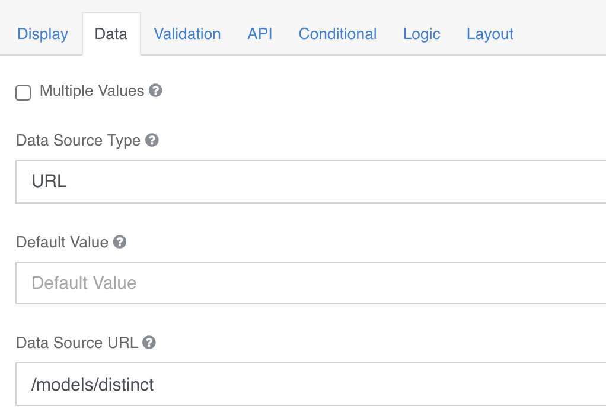
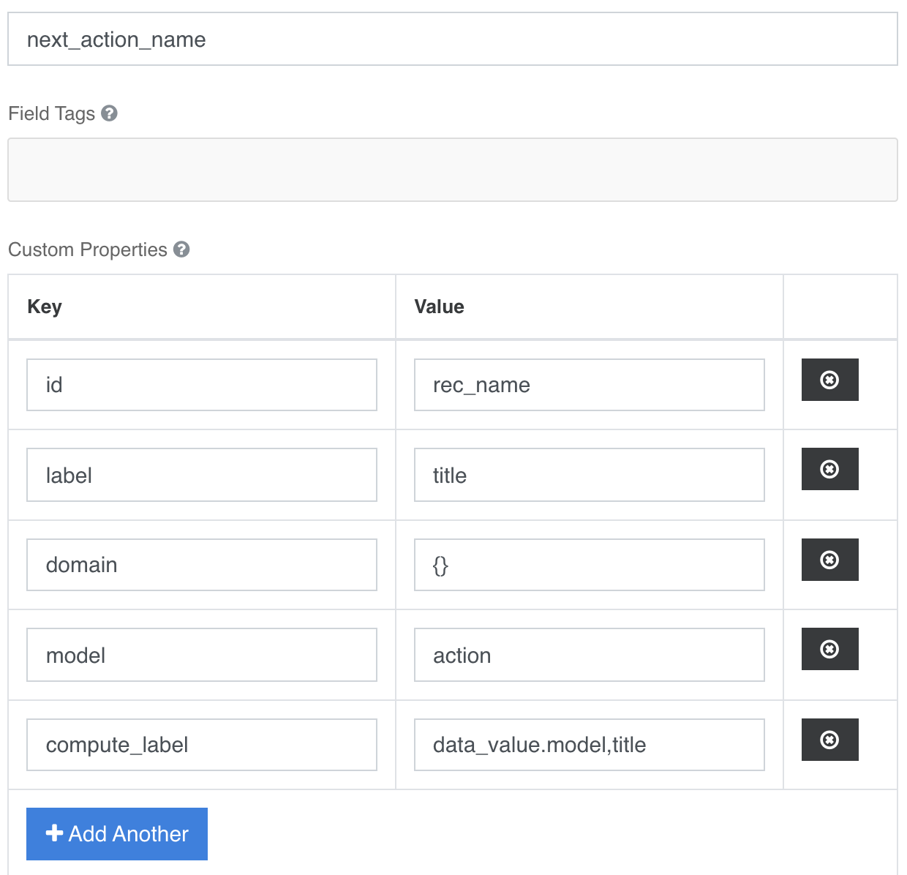

### Select
E’ possibile usare i campi select in molteplici modi, inizialmente è possibile gestirli come:  
**Select singolo**  o **Select multiplo**; mettendo la spunta su **Data --> Multiple values** la select sarà multiselect nel form.  

### Dati Form esterno
E’ possibile creare un dropdown select con gli elementi che vengono popolati da valori dai dati inseriti in un altro Form **non Risorsa.**

**Configurazione Tab Data [fig.1]:**  
- Data Source Type → Url
- Data Source URL → /models/distinct

**Configurazione Tab API → Custom Properties [fig.2]:**

- **Id →** rec_name (è il valore che viene usato come option val nella lista select)   
- **label →** il nome del campo che si ritiene indicativo per l’utente (es **Title**)  
- **domain →**  {} query domain da applicare per ridurre la lista nel set di dati desiderato  
- **model →** il rec_name del Form dal quale si desidera estrarre le informazioni.  
- **compute_label →** [Opzionale] computa la label unendo i valori di più campi divisi da “-”

Per un esempio di utilizzo complesso del form è possibile vedere in

**Design → Form → Action Model →** Tab [ **Next Action** ] → Campo [ **Azione Successiva** ] →
tab [ **API** ]

### Computed value
**Attenzione: per questa funzionalità è  necessario lo sviluppo di codice specifico.**    
Per attivare un calcolo automatico di un campo, si deve mettere la spunta al flag 
**Calculate Value on server** e quindi aggiungere il nome del metodo all’ interno della configurazione **Calculated Value**  

**I valori calcolati saranno aggiornati solo al** **salva** **del form e non al change delle informazioni.**

Il metodo deve essere inserito in una classe che estende **ServiceAction** tenendo conto della corretta catena di ereditarietà di tutti i plugins installati.

La firma del metodo prevede un parametro **data** di tipo dizionario, in ingresso;  
tale dizionario contiene tutti i dati del record da salvare, è possibile quindi nel metodo modificare i valori del record come necessario prima che tali dati vengano salvati.  
Il metodo deve ritornare **data**,  eventualmente modificato.  

[torna alla home](../../index.md)
