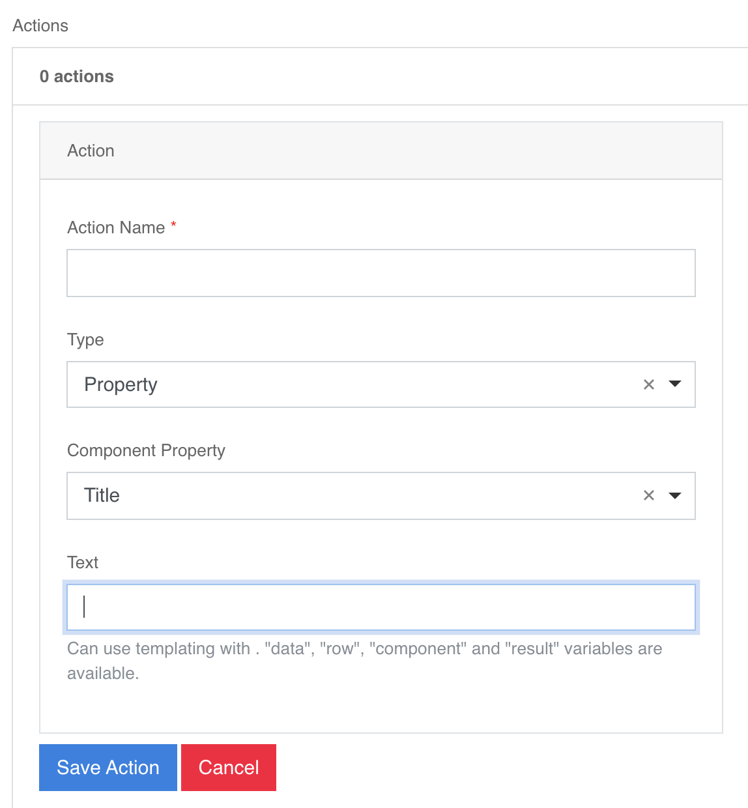
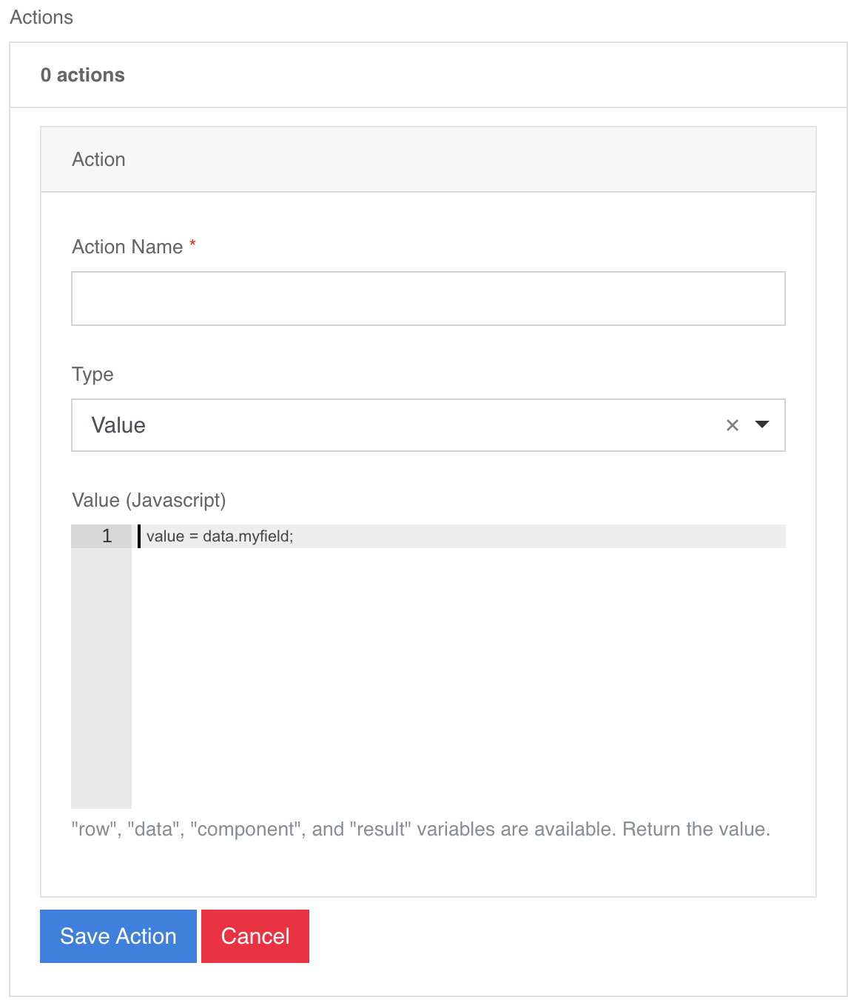

# Logic:Json-Logic
Guida  → [Json-logic](https://jsonlogic.com/operations.html)  

**Sezione Conditional → Advanced Conditions → JSONLogic**  
Le logiche in questa sezione sono “negate” di default siccome agiscono direttamente 
sulla proprietà **“hidden”** del campo in cui vengono inserite.  
- Il risultato delle logiche inserite deve essere booleano  
- Mappa logica:
    - {logica} ==> True  → Risultato = False
    - {logica} ==> False → Risultato = True  

**Sezione Logic**  
Le Logiche sui campi sono gestite solo con **json logic**; è possibile inserire molteplici logiche, per ogni logica e’ possibile inserire molteplici azioni.  
Le logiche sono suddivise in due gruppi specifici: **condizioni, azioni**  
Le **condizioni** sono elementi che il configuratore identifica con **Logic**, le **azioni** sono elementi che il configuratore identifica con **Action**.  
Nelle espressioni json-logic è possibile usare nelle **“var”** i seguenti oggetti:  

  

**form.[Property Name ] →  form.rec_name  
form.data_value.[Property Name ]  → form.data_value.dataOra  
user.{[metadata](base.md#Neicomponentisonogestiteleseguentiproprietà)}**

Per quanto riguarda le azioni è possibile gestire le sole azioni di tipo: **Property o Value**   
- **Property →** la proprietà selezionata assume il valore inserito nel campo apposito  

  

- **Value →** è possibile valorizzare qualsiasi proprietà del campo con le seguenti modalità:  
    - con il risultato della **condizione** se si inserisce il solo nome della proprietà 
    - con un'operazione **json-logic** se si inserisce **nome_campo=’{“var”:[....]}’**  

  

